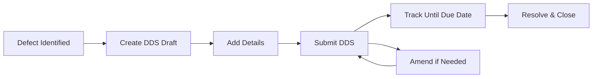

## Overview

EUW introduces three custom DocTypes that extend ERPNext's document model for specialized work order scenarios. Each DocType serves a specific purpose in the work order management workflow.

<CardGroup cols={3}>
  <Card title="Applicability" icon="tag">
    Master data for categorization
  </Card>
  <Card title="DDS" icon="file-exclamation">
    Deferred Defect Sheets
  </Card>
  <Card title="NRC" icon="wrench">
    Non-Routine Cards
  </Card>
</CardGroup>

## Applicability

### Purpose

Applicability is a master data DocType used to categorize items based on their applicability criteria. It provides a simple classification system that can be linked to Items.

### Structure

The Applicability DocType has a minimal structure focused on identification:

```json doctype/applicability/applicability.json
{
  "doctype": "DocType",
  "name": "Applicability",
  "module": "EUW",
  "autoname": "field:title",
  "naming_rule": "By fieldname",
  "fields": [
    {
      "fieldname": "title",
      "fieldtype": "Data",
      "label": "Title",
      "reqd": 1,
      "unique": 1
    }
  ]
}
```

### Key Features

- **Auto-naming**: Records are named directly from the title field
- **Unique titles**: Each applicability must have a distinct title
- **Quick entry**: Enabled for fast data entry
- **Simple model**: Intentionally minimal for flexibility

### Implementation

```python doctype/applicability/applicability.py
from frappe.model.document import Document

class Applicability(Document):
    pass
```

<Note>
The implementation is intentionally simple, inheriting all behavior from Frappe's base Document class. Business logic can be added as needed.
</Note>

### Usage Example

Applicability records might include:
- Aircraft models (e.g., "Boeing 737-800")
- Component types (e.g., "Landing Gear")
- Regulatory categories (e.g., "AD 2024-01 Applicable")

### Integration

Applicability is linked to the Item DocType through a custom field:

```json
{
  "dt": "Item",
  "fieldname": "custom_applicability",
  "fieldtype": "Link",
  "options": "Applicability",
  "label": "Applicability"
}
```

## DDS (Deferred Defect Sheet)

### Purpose

DDS tracks deferred defects that have been identified but postponed for later resolution. It manages the lifecycle of defects from identification to resolution, including deferral reasons and MEL/CDL references.

### Structure

```json doctype/dds/dds.json
{
  "doctype": "DocType",
  "name": "DDS",
  "module": "EUW",
  "is_submittable": 1,
  "naming_series": "DDS-.YYYY.-####",
  "fields": [
    {
      "fieldname": "description",
      "fieldtype": "Data",
      "label": "Description",
      "reqd": 1
    },
    {
      "fieldname": "issue_date",
      "fieldtype": "Date",
      "label": "Issue Date",
      "reqd": 1
    },
    {
      "fieldname": "due_date",
      "fieldtype": "Date",
      "label": "Due Date",
      "reqd": 1
    },
    {
      "fieldname": "interval",
      "fieldtype": "Data",
      "label": "Interval"
    },
    {
      "fieldname": "mel_cdl_reference",
      "fieldtype": "Data",
      "label": "MEL/ CDL Reference"
    },
    {
      "fieldname": "defferral_reason",
      "fieldtype": "Data",
      "label": "Defferral Reason"
    }
  ]
}
```

### Key Features

<AccordionGroup>
  <Accordion title="Submittable Workflow">
    DDS is a submittable DocType, meaning it has a formal approval workflow:
    - **Draft**: Initial state, editable
    - **Submitted**: Locked and official
    - **Cancelled**: Reversed submission
    
    This ensures audit trail and formal approval processes.
  </Accordion>
  
  <Accordion title="Auto-naming with Year">
    Documents are automatically named using the pattern:
    ```
    DDS-.YYYY.-####
    ```
    
    Examples:
    - DDS-2024-0001
    - DDS-2024-0002
    - DDS-2025-0001 (resets yearly)
  </Accordion>
  
  <Accordion title="Amendment Support">
    The `amended_from` field allows for document amendments:
    - Submit original: DDS-2024-0001
    - Amend: Creates DDS-2024-0001-1
    - Further amends: DDS-2024-0001-2
  </Accordion>
</AccordionGroup>

### Field Descriptions

| Field | Type | Description |
|-------|------|-------------|
| **description** | Data | Brief description of the defect (required) |
| **issue_date** | Date | When the defect was identified (required) |
| **due_date** | Date | Deadline for resolution (required) |
| **interval** | Data | Inspection/check interval |
| **mel_cdl_reference** | Data | Reference to Minimum Equipment List or Configuration Deviation List |
| **defferral_reason** | Data | Justification for deferring the defect |

### Implementation

```python doctype/dds/dds.py
from frappe.model.document import Document

class DDS(Document):
    pass
```

<Tip>
While the current implementation is simple, you can add validation logic here:

```python
class DDS(Document):
    def validate(self):
        # Ensure due date is after issue date
        if self.due_date and self.issue_date:
            if self.due_date < self.issue_date:
                frappe.throw("Due Date cannot be before Issue Date")
        
        # Require MEL/CDL reference for certain scenarios
        if self.defferral_reason and not self.mel_cdl_reference:
            frappe.msgprint("MEL/CDL Reference recommended for deferred defects")
```
</Tip>

### Workflow Example



## NRC (Non-Routine Card)

### Purpose

NRC documents non-routine work requests that fall outside standard maintenance procedures. It tracks corrective actions and open dates for work that requires special attention.

### Structure

```json doctype/nrc/nrc.json
{
  "doctype": "DocType",
  "name": "NRC",
  "module": "EUW",
  "is_submittable": 1,
  "naming_series": "NRC-.YYYY.-####",
  "fields": [
    {
      "fieldname": "description",
      "fieldtype": "Data",
      "label": "Work Request Description",
      "reqd": 1
    },
    {
      "fieldname": "open_date",
      "fieldtype": "Date",
      "label": "OPEN DATE",
      "reqd": 1
    },
    {
      "fieldname": "ata_ch",
      "fieldtype": "Data",
      "label": "ATA CH"
    },
    {
      "fieldname": "corrective_action",
      "fieldtype": "Data",
      "label": "Corrective Action"
    }
  ]
}
```

### Key Features

- **Submittable**: Like DDS, uses formal approval workflow
- **Year-based naming**: Pattern `NRC-.YYYY.-####` (e.g., NRC-2024-0001)
- **Amendment support**: Can be amended after submission
- **ATA chapter tracking**: Links work to Air Transport Association chapters

### Field Descriptions

| Field | Type | Description |
|-------|------|-------------|
| **description** | Data | Work request description (required) |
| **open_date** | Date | When the work request was opened (required) |
| **ata_ch** | Data | ATA chapter reference for maintenance categorization |
| **corrective_action** | Data | Description of the corrective action to be taken |

### Implementation

```python doctype/nrc/nrc.py
from frappe.model.document import Document

class NRC(Document):
    pass
```

### ATA Chapter System

The `ata_ch` field references the Air Transport Association chapter system, which categorizes aircraft systems:

<Accordion title="Common ATA Chapters">
- **ATA 20-29**: Airframe Systems
- **ATA 30-39**: Structure
- **ATA 40-49**: Power Plant
- **ATA 50-59**: Structure (Continued)
- **ATA 70-79**: Engine
- **ATA 80-89**: Electrical

Example: "ATA 32" might refer to landing gear issues.
</Accordion>

## DocType Comparison

<ResponseField name="Comparison Table">
  | Feature | Applicability | DDS | NRC |
  |---------|--------------|-----|-----|
  | **Purpose** | Categorization | Defect tracking | Work requests |
  | **Submittable** | No | Yes | Yes |
  | **Naming** | Field-based | Series with year | Series with year |
  | **Complexity** | Simple | Medium | Medium |
  | **Required Fields** | 1 | 3 | 2 |
  | **Amendment** | N/A | Yes | Yes |
</ResponseField>

## Permissions

All three DocTypes currently grant full permissions to System Manager:

```json
{
  "role": "System Manager",
  "create": 1,
  "read": 1,
  "write": 1,
  "delete": 1,
  "submit": 1,
  "cancel": 1,
  "amend": 1
}
```

<Warning>
In production, consider implementing role-based permissions:
- **Maintenance Technician**: Create/read DDS and NRC
- **Maintenance Supervisor**: Submit/approve
- **Quality Manager**: Full access including cancel
</Warning>

## Testing

Each DocType includes a test module:

```python
# test_applicability.py
# test_dds.py
# test_nrc.py
```

Run tests with:

```bash
bench --site [sitename] run-tests --app euw --doctype "Applicability,DDS,NRC"
```

## Next Steps

<CardGroup cols={2}>
  <Card title="Architecture" icon="sitemap" href="/concepts/architecture">
    Learn about EUW's overall architecture
  </Card>
  <Card title="Customizations" icon="sliders" href="/concepts/customizations">
    Explore how EUW extends standard DocTypes
  </Card>
</CardGroup>