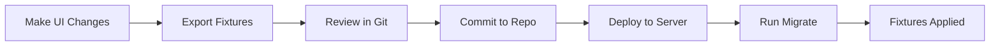

Fixtures are Frappe's mechanism for exporting and importing customizations as version-controlled JSON files. EUW uses fixtures to distribute customizations across installations.

## What are Fixtures?

Fixtures allow you to:
- Export customizations from a development site
- Version control UI customizations
- Deploy consistent configurations across environments
- Share customizations between team members
- Package customizations with your app

## EUW Fixtures Configuration

The EUW app defines its fixtures in `hooks.py`:

```python /home/daytona/workspace/source/euw/hooks.py:220
fixtures=['Client Script', 'Custom Field', 'Property Setter', 'Print Format', 'Translation']
```

These fixture types enable different customizations:

## Fixture Types

### Client Script

Client Scripts add JavaScript functionality to forms.

<Accordion title="Example: Item Client Script">
Location: `fixtures/client_script.json`

```json /home/daytona/workspace/source/euw/fixtures/client_script.json:1-13
[
  {
    "doctype": "Client Script",
    "dt": "Item",
    "enabled": 1,
    "module": "EUW",
    "name": "Item Script",
    "script": "frappe.ui.form.on('Item', {\n    custom_is_tool(frm) {\n        if(frm.doc.custom_is_tool){\n            frm.set_value(\"is_fixed_asset\", 1)\n            frm.set_value(\"asset_category\", 'Tools - أدوات')\n        }else{\n            frm.set_value(\"is_stock_item\", 1)\n            frm.set_value(\"is_fixed_asset\", 0)\n            frm.set_value(\"asset_category\", )\n        }\n    }\n})",
    "view": "Form"
  }
]
```

This script automatically sets asset properties when the `custom_is_tool` checkbox is toggled on Items.
</Accordion>

**Key Properties:**
- **dt**: Target DocType
- **script**: JavaScript code
- **view**: Where to run (Form, List, etc.)
- **enabled**: Activation status

### Custom Field

Custom Fields extend standard DocTypes with additional fields.

<Accordion title="View Custom Field Examples">
Location: `fixtures/custom_field.json`

EUW adds extensive custom fields including:

**HR & Payroll Fields on Company:**
```json
{
  "dt": "Company",
  "fieldname": "default_expense_claim_payable_account",
  "fieldtype": "Link",
  "options": "Account",
  "label": "Default Expense Claim Payable Account"
}
```

**Approver Configuration on Employee:**
```json
{
  "dt": "Employee",
  "fieldname": "expense_approver",
  "fieldtype": "Link",
  "options": "User",
  "label": "Expense Approver"
}
```

**Branch Tracking on Asset:**
```json
{
  "dt": "Asset",
  "fieldname": "branch",
  "fieldtype": "Link",
  "options": "Branch",
  "label": "Branch"
}
```
</Accordion>

See the [Custom Fields Guide](/guides/custom-fields) for detailed documentation.

### Property Setter

Property Setters modify properties of standard fields without creating new fields.

<Accordion title="Example Property Setters">
Location: `fixtures/property_setter.json`

**Hide and Disable Naming Series:**
```json /home/daytona/workspace/source/euw/fixtures/property_setter.json:1-33
[
  {
    "doc_type": "Item",
    "field_name": "naming_series",
    "property": "reqd",
    "value": "0"
  },
  {
    "doc_type": "Item",
    "field_name": "naming_series",
    "property": "hidden",
    "value": "1"
  }
]
```

**Make Item Code Required:**
```json /home/daytona/workspace/source/euw/fixtures/property_setter.json:50-65
{
  "doc_type": "Item",
  "field_name": "item_code",
  "property": "reqd",
  "value": "1"
}
```

**Change Field Labels:**
```json /home/daytona/workspace/source/euw/fixtures/property_setter.json:120-128
{
  "doc_type": "Item",
  "field_name": "manufacturing",
  "property": "label",
  "value": "include in WO"
}
```

**Configure Naming Series Options:**
```json /home/daytona/workspace/source/euw/fixtures/property_setter.json:104-113
{
  "doc_type": "Item",
  "field_name": "naming_series",
  "property": "options",
  "value": "STO-ITEM-.YYYY.-"
}
```
</Accordion>

**Common Properties Modified:**
- `hidden`: Show/hide fields
- `reqd`: Make fields mandatory
- `read_only`: Make fields non-editable
- `options`: Change dropdown options
- `label`: Rename field labels
- `default`: Set default values

### Print Format

Print Formats define how documents are printed or exported to PDF.

<Accordion title="Print Format Examples">
Location: `fixtures/print_format.json`

EUW includes various print formats:

**Standard Formats:**
- Job Offer
- Salary Slip Standard
- Point of Sale
- Pick List
- Tax Invoice variants

**Custom Invoice Print Format:**
```json /home/daytona/workspace/source/euw/fixtures/print_format.json:654-683
{
  "doc_type": "Sales Invoice",
  "name": "invoice print",
  "custom_format": 1,
  "html": "Custom HTML template with QR code",
  "print_format_type": "Jinja"
}
```
</Accordion>

**Key Properties:**
- **doc_type**: Target DocType
- **html**: HTML/Jinja template
- **css**: Custom styling
- **print_format_type**: Jinja, JS, or Standard

### Translation

Translations customize terminology to match business language.

<Accordion title="Translation Examples">
Location: `fixtures/translation.json`

EUW renames "Issue" to "W/O" (Work Order) throughout the interface:

```json /home/daytona/workspace/source/euw/fixtures/translation.json:1-93
[
  {
    "language": "en",
    "source_text": "Issue",
    "translated_text": "W/O"
  },
  {
    "language": "en",
    "source_text": "Issue Type",
    "translated_text": "W/O Type"
  },
  {
    "language": "en",
    "source_text": "Issue Priority",
    "translated_text": "W/O Priority"
  },
  {
    "language": "en",
    "source_text": "Issues",
    "translated_text": "W/O's"
  }
]
```
</Accordion>

**Translation Properties:**
- **source_text**: Original text
- **translated_text**: Replacement text
- **language**: Target language code

## Fixture Directory Structure

```
euw/
├── fixtures/
│   ├── client_script.json
│   ├── custom_field.json
│   ├── property_setter.json
│   ├── print_format.json
│   └── translation.json
├── euw/
│   └── custom/
│       ├── asset.json
│       ├── customer.json
│       ├── issue.json
│       ├── item.json
│       └── maintenance_visit_purpose.json
└── hooks.py
```

<Note>
The `euw/custom/` directory contains additional customization files that are separate from the main fixtures system.
</Note>

## Working with Fixtures

### Exporting Fixtures

To export all fixtures from your site:

```bash
bench --site [site-name] export-fixtures
```

This reads the fixture configuration from `hooks.py` and exports each DocType to the appropriate JSON file.

### Exporting Specific Fixture Types

Export only certain DocTypes:

```bash
bench --site [site-name] export-fixtures --app euw --doctype "Custom Field"
```

### Importing Fixtures

Fixtures are automatically imported when:

**1. Installing the app:**
```bash
bench --site [site-name] install-app euw
```

**2. Running migrations:**
```bash
bench --site [site-name] migrate
```

**3. Manual import:**
```bash
bench --site [site-name] import-doc [path-to-fixture-file]
```

### Syncing Fixtures

To update fixtures after making UI changes:

```bash
# Make changes in the UI (Customize Form, etc.)
bench --site [site-name] export-fixtures
# Review changes in git
git diff
# Commit changes
git add euw/fixtures/
git commit -m "Update custom fields"
```

## Best Practices

<Note>
**Version Control**: Always commit fixture files to version control to track customization history.
</Note>

<Note>
**Export Regularly**: Export fixtures after making UI customizations to keep your code repository synchronized.
</Note>

<Note>
**Test Before Deployment**: Test fixture imports on a staging environment before deploying to production.
</Note>

<Note>
**Document Custom Logic**: Add comments in your JSON files or maintain separate documentation for complex customizations.
</Note>

## Fixture Workflow



## Common Use Cases

### Adding a Custom Field

1. Use "Customize Form" in the UI
2. Add your custom field
3. Export fixtures: `bench export-fixtures`
4. Find your field in `fixtures/custom_field.json`
5. Commit and deploy

### Modifying Field Behavior

1. Use "Customize Form" to change field properties
2. Export fixtures: `bench export-fixtures`
3. Changes appear in `fixtures/property_setter.json`
4. Commit and deploy

### Creating Print Formats

1. Create print format in Print Format list
2. Design your template
3. Export fixtures: `bench export-fixtures`
4. Find template in `fixtures/print_format.json`
5. Commit and deploy

## Troubleshooting

<Accordion title="Fixtures not importing">
1. Check `hooks.py` includes the fixture type
2. Verify JSON syntax is valid
3. Run `bench migrate` explicitly
4. Check error logs: `bench --site [site] console`
</Accordion>

<Accordion title="Old fixtures persisting">
Fixtures don't auto-delete. To remove:
1. Delete the record manually in the UI
2. Export fixtures to remove from JSON
3. Or add deletion logic in migration
</Accordion>

<Accordion title="Conflicts with other apps">
- Use unique naming (prefix with app name)
- Check fixture load order in sites/apps.txt
- Review custom field naming conventions
</Accordion>

## Advanced Topics

### Custom Fixture Handling

For complex scenarios, use hooks to process fixtures:

```python
# hooks.py
fixtures = [
    {
        "dt": "Custom Field",
        "filters": [["dt", "in", ["Item", "Asset", "Employee"]]]
    }
]
```

### After Install Hooks

Run custom code after fixtures import:

```python
# hooks.py
after_install = "euw.install.after_install"

# install.py
def after_install():
    # Custom post-installation logic
    pass
```

## Related Resources

<CardGroup cols={2}>
  <Card title="Custom Fields Guide" icon="input-text" href="/guides/custom-fields">
    Detailed custom field documentation
  </Card>
  <Card title="Configuration" icon="gear" href="/guides/configuration">
    App configuration and hooks
  </Card>
</CardGroup>

## Migration Considerations

<Warning>
When upgrading Frappe/ERPNext versions:
- Review fixture structure changes
- Test imports on a staging site first
- Check for deprecated field types
- Update custom scripts for API changes
</Warning>
